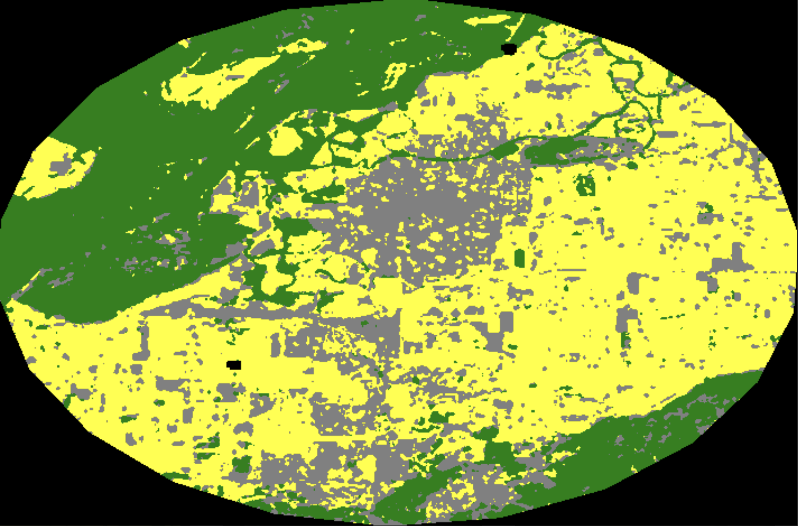
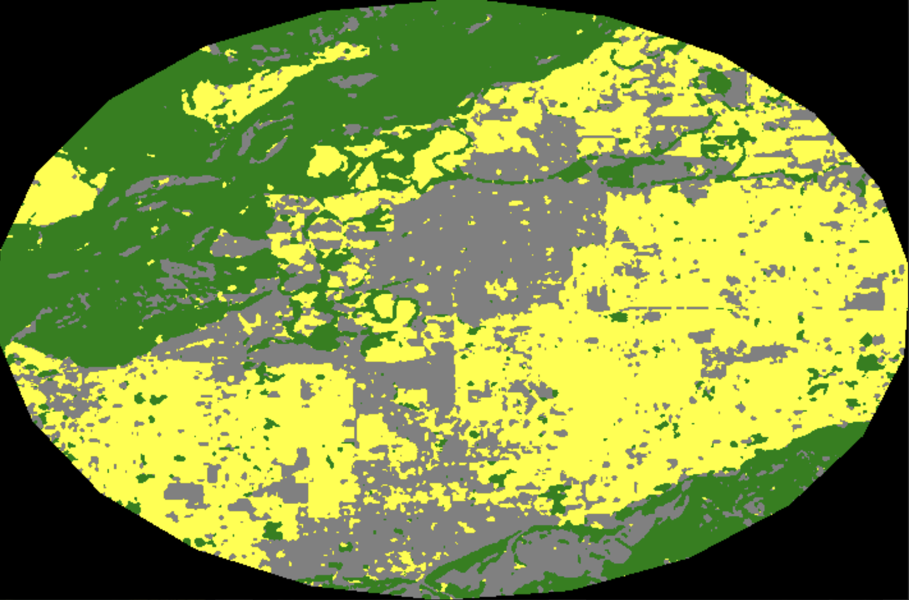
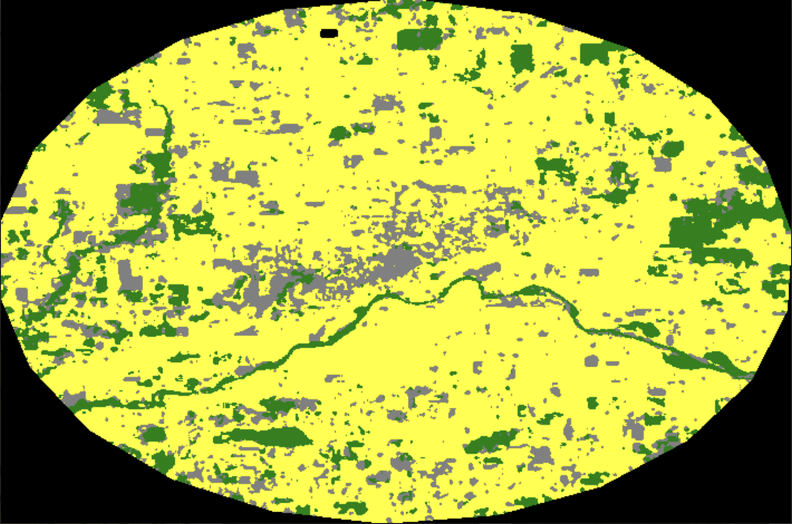
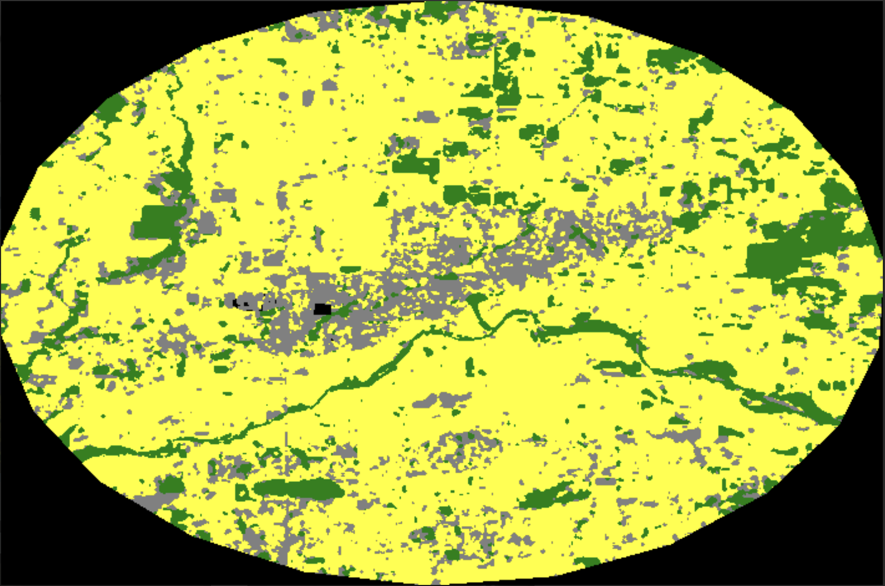

# A Tale of Two Valleys

**Mapping agricultural land loss in the Fraser Valley through cross-border classification, 2000–2025.**

A 25-year remote sensing analysis comparing how agricultural land has changed around Chilliwack, BC and Lynden, WA — two similar agricultural towns on opposite sides of the 49th parallel, operating under different farmland protection regimes (BC's Agricultural Land Reserve vs. Washington's Growth Management Act).

---

## Key Findings

- **Chilliwack, BC lost ~894 hectares of agricultural land (−12%)** between 2000 and 2025, while urban land grew by ~1,077 ha (+33%).
- **Lynden, WA remained essentially stable** (+0.6% agricultural, −8% urban) over the same period.
- The findings didn't show that the stricter Agricultural Land Reserve would result in stronger farmland protection in BC. Instead, they suggest that development pressure from neighboring Metro Vancouver may outweigh policy protection, while Lynden's apparent stability may reflect absence of comparable pressure rather than superior policy.
- The Random Forest classifier achieved **95.61% overall accuracy** with internal validation with a **Kappa coefficient of 0.945** across 9 land cover classes — around similar published benchmarks for similar Landsat-based agricultural classification studies (Hao et al., 2019; Gandharum et al., 2022).

---

## Methodology

### Data sources
- **Landsat 5 TM** (2000, 2005, 2010)
- **Landsat 8 OLI** (2015, 2020)
- **Landsat 9 OLI-2** (2025)
- **SRTM Global 1 arc-second DEM** for slope derivation
- All data accessed through **Google Earth Engine**

### Methods
1. **Cloud masking** using Landsat Collection 2 QA_PIXEL bitmask (cloud + cloud shadow, per-pixel)
2. **Surface reflectance scaling** via the standard Collection 2 transformation (USGS, 2024)
3. **Dual-season median compositing**:
   - Leaf-on (June 1 – September 1): peak vegetation greenness
   - Leaf-off (September 15 – December 1): post-harvest contrast
4. **11-band feature stack**: Blue/Green/Red/NIR/SWIR × 2 seasons + SRTM slope
5. **Random Forest classification** (100 trees, sqrt(11) variables per split) trained on hand-digitized polygons at 9 land cover classes
6. **Modal filter (3×3)** to reduce salt-and-pepper noise
7. **3-class remapping** (Nature / Agricultural / Urban) for time series analysis
8. **Area statistics** via `reduceRegion` with grouped sum on `pixelArea()`

### Why these methodological choices?
- **Random Forest over SVM** for computational efficiency without meaningful accuracy loss (Noi & Kappas, 2018)
- **Dual-season stacking** to resolve agricultural ↔ suburban spectral confusion at peak summer greenness (Ramoni et al., 2000; Vogelmann et al., 2001)
- **SWIR band** to separate bare agricultural soil from impervious urban surfaces
- **Slope feature** to discriminate suburban areas (necessarily flat) from forested mountain slopes
- **30 m resolution maintained throughout** to ensure cross-sensor temporal consistency

---

## Tech Stack

- **Google Earth Engine** (JavaScript API) — primary analysis platform
- **Landsat Collection 2 Level-2 Surface Reflectance** — atmospheric-corrected imagery
- **SRTM Global 1 arc-second** — topographic data

---

## Repository Structure

```
fraser-valley-land-classification/
├── README.md                                  # This file
├── LICENSE                                    # MIT License
├── .gitignore
├── script/
│   └── fraser_valley_classification.js        # Main GEE script
├── paper/
│   ├── EEPS1330_FinalPaper_Kutlu.pdf          # Final research paper
├── data/
│   ├── area_timeseries.csv                    # Time series area data
│   ├── confusion_matrix.csv                   # 9-class accuracy matrix
│   └── graphs/                                # Time series graphs for Chilliwack and Lynden (2000-2025)
└── outputs/ 
│   ├── Chilliwack_2000.png                    # 3-class classification for Chilliwack, BC, 2000
│   ├── Chilliwack_2025.png                    # 3-class classification for Chilliwack, BC, 2025
│   ├── Lynden_2000.png                        # 3-class classification for Lynden, WA, 2000
│   ├── Lynden_2025.png                        # 3-class classification for Lynden, WA, 2025
│   └── outputs_link.txt                       # Link to Google Drive folder with 9-class and 3-class classifications, and true colour images.
```

---

## Running the Code

### Prerequisites
- A free [Google Earth Engine](https://earthengine.google.com/) account
- Familiarity with the GEE Code Editor

### Steps
1. Open the [Google Earth Engine Code Editor](https://code.earthengine.google.com/)
2. Create a new script and paste the contents of [`script/fraser_valley_classification.js`](script/fraser_valley_classification.js)
3. **Draw training polygons** for your study area using the geometry tools in the GEE Code Editor. The script expects nine polygon variables: `forest`, `fraser_river`, `pond`, `river`, `field_agricultural`, `industrial`, `downtown`, `suburban`, `marsh_bank`. Adapt the class names and number to suit your study area.
4. Adjust the study area coordinates at the top of the script if you want to apply it elsewhere.
5. Run the script. Time series area statistics will print to the console; image exports queue as tasks in the Tasks tab.

### Notes
- The full pipeline takes approximately 10–15 minutes to complete in the GEE Code Editor depending on server load.
- Export tasks must be manually started in the Tasks tab.
- For a study area of 7 km radius, the classifier handles ~30,000 training pixels comfortably.

---

## Results Preview

### 3-class classification: Chilliwack, BC (2000 vs. 2025)



### 3-class classification: Lynden, WA (2000 vs. 2025)



### Agricultural area over time
.png)
.png)

### Confusion matrix summary
| Metric | Value |
|--------|-------|
| Overall Accuracy | **95.61%** |
| Kappa Coefficient | **0.9454** |
| Number of classes | 9 |
| Validation method | 20% holdout from training polygons |

---

## Limitations

This project was conducted as part of an undergraduate course, with some points to flag:

- **Internal validation**: The 95.6% accuracy reflects a 20% holdout from the same hand-drawn polygons used to train the classifier, not  ground-truth verification. True accuracy against independent reference data would likely be lower.
- **2020 anomaly in Lynden**: The Nature class spikes to ~3,500 ha that year (vs. ~1,500–1,800 ha in other years), potentially reflecting COVID-era surface conditions altering suburban spectral signatures rather than real land cover change.
- **30 m resolution**: Minimum mapping unit is approximately 1–2 hectares; smaller parcel conversions and urban infill are below the detection threshold.
- **Single-year training**: The classifier was trained on 2015 Chilliwack imagery and applied across 25 years and to the Lynden study area. Cross-sensor spectral drift and assumption of spectral signature equivalence across the border introduce unquantified bias.
- **Cross-border policy comparison**: The structural difference between BC's provincial ALR and Whatcom County's local GMA-based zoning is genuine, but Lynden's stability may reflect lack of development pressure rather than superior policy efficacy.

---

## Citation

If you use this code or methodology in your own work:

```
Kutlu, S. (2026). A Tale of Two Valleys: Mapping, Quantifying, and Verifying
  Agricultural Land Changes in the Fraser Valley, Canada Through Cross-Border
  Classification. EEPS 1330 Final Project, Brown University.
```

---

## Context

This project was conducted for **EEPS 1330: Global Environmental Remote Sensing** at Brown University, Spring 2026 semester.

The choice of study areas reflects ongoing concerns in BC about the long-term efficacy of the Agricultural Land Reserve under intense urban expansion pressure (Nixon & Newman, 2016; Gemino et al., 2026), and is methodologically inspired by recent Google Earth Engine-based agricultural change detection studies (Gandharum et al., 2022; Hao et al., 2019; Arpitha et al., 2023).

---

## Key References

- Arpitha, M., Ahmed, S. A., & Harishnaika, N. (2023). Land use and land cover classification using machine learning algorithms in Google Earth Engine. *Earth Science Informatics*, 16, 3057–3073.
- Chuvieco, E. (2020). *Fundamentals of Satellite Remote Sensing: An Environmental Approach*. CRC Press, Taylor & Francis Group.
- Gandharum, L., Hartono, D. M., Karsidi, A., & Ahmad, M. (2022). Monitoring Urban Expansion and Loss of Agriculture on the North Coast of West Java Province, Indonesia, Using Google Earth Engine and Intensity Analysis. *Environmental Monitoring and Assessment*, 2022(1).
- Gemino, C., Soma, T., & Bodnar, C. (2026). Preserving Farmlands: A Land Use Land Cover Analysis of the Agricultural Land Reserve in Metro Vancouver. *Canadian Planning and Policy / Aménagement et politique au Canada*, 2, 27–47.
- Hao, P., Chen, Z., Tang, H., Li, D., & Li, H. (2019). New Workflow of Plastic-Mulched Farmland Mapping using Multi-Temporal Sentinel-2 Data. *Remote Sensing*, 11(11), 1353.
- Kowalenko, C. G., Schmidt, O., & Hughes-Games, G. (2007). *A Survey Of The Nitrogen, Phosphorus And Potassium Contents Of Lower Fraser Valley Agricultural Soils In Relation To Environmental And Agronomic Concerns*. British Columbia Agricultural Council.
- La Croix, A. D., Dashtgard, S. E., Hill, P. R., Ayranci, K., & Clague, J. J. (2024). The Holocene to modern Fraser River Delta, Canada: geological history, processes, deposits, natural hazards, and coastal management. *Canadian Journal of Earth Sciences*, 61(10), 1043–1075.
- Metro Vancouver Regional District. (2022). *Metro 2050 Regional Growth Strategy*.
- MRSC. (n.d.). Growth Management Act Basics.
- Mullinix, K., Dorward, C., Shutzbank, M., Krishnan, P., Ageson, K., & Fallick, A. (2013). Beyond protection: Delineating the economic and food production potential of underutilized, small-parcel farmland in metropolitan Surrey, British Columbia. *Journal of Agriculture, Food Systems, and Community Development*, 4(1), 33–50.
- Nixon, D. V., & Newman, L. (2016). The efficacy and politics of farmland preservation through land use regulation: Changes in southwest British Columbia's Agricultural Land Reserve. *Land Use Policy*, 59(1), 227–240.
- Noi, P. T., & Kappas, M. (2018). Comparison of Random Forest, k-Nearest Neighbor, and Support Vector Machine Classifiers for Land Cover Classification Using Sentinel-2 Imagery. *Sensors*, 18(1).
- Northwest Hydraulic Consultants. (2017). *Freshet Flooding and Fraser Valley Agriculture: Evaluating Impacts and Options for Resilience Study Final Report*. Investment Agriculture Foundation.
- Ramoni, M., Sebastiani, P., & Cohen, P. R. (2000). Multivariate clustering by dynamics. *Proceedings of the Seventeenth National Conference on Artificial Intelligence*, 633–638.
- USGS. (2024). *Landsat 8-9 Collection 2 (C2) Level 2 Science Product (L2SP) Guide* [Version 6.0].
- Vogelmann, J., Howard, S. M., Yang, L., Larson, C. R., Wylie, B. K., & Van Driel, J. N. (2001). Completion of the 1990s National Land Cover Data Set for the Conterminous United States From LandSat Thematic Mapper Data and Ancillary Data Sources. *Photogrammetric Engineering & Remote Sensing*, 67(6), 650–655.

Full bibliography available in the paper PDF.

---

## Author

**Selim Kutlu** — Brown University / RISD Dual Degree Program, Class of 2029
B.A. Computer Science | B.F.A. Printmaking

Interested in: geospatial machine learning, climate and environmental data visualization, applied remote sensing for sustainability and land use change.

🌐 [LinkedIn](https://www.linkedin.com/in/selim-kutlu-277b1b22a/)

---

## License

This project is licensed under the MIT License — see the [LICENSE](LICENSE) file for details.

Training polygon geometries and the final paper PDF are © 2026 Selim Kutlu and may be referenced with attribution but not reproduced commercially without permission.
x